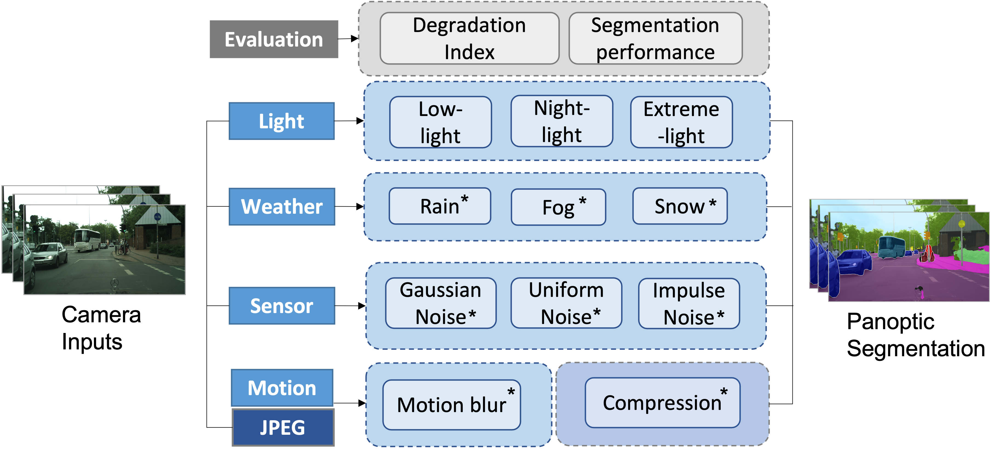
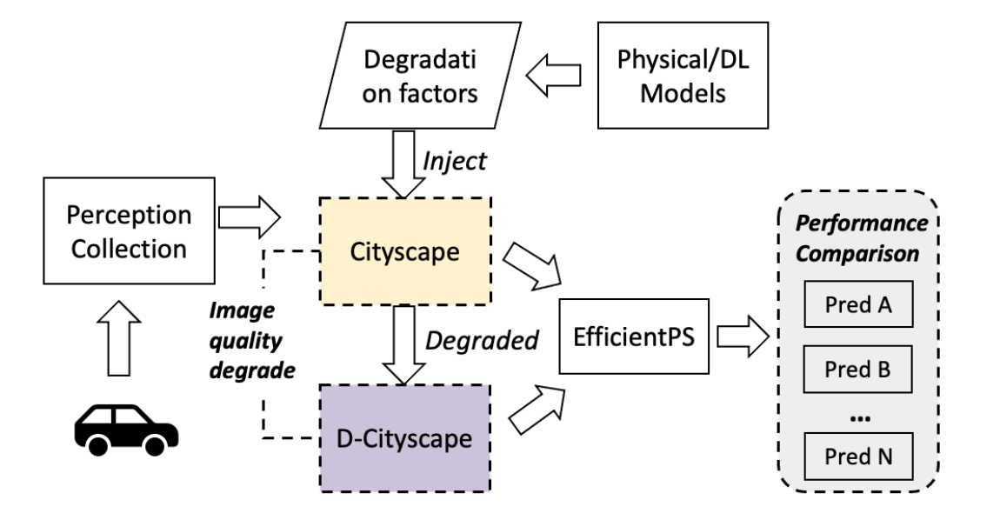

# The-Effect-of-Camera-Data-Degradation-Factors-on-Panoptic-Segmentation-for-Automated-Driving
This is the **PyTorch re-implementation** of our ITSC2023 paper: 
The Effect of Camera Data Degradation Factors on Panoptic Segmentation for Automated Driving, [link]([https://ieeexplore.ieee.org/abstract/document/10421803]). 




- In this paper, we consider 5 categories of camera data degradation models, namely light level, adverse weather, internal sensor noises, motion blur and compression artefacts. 
- Based on 11 models and multiple degradation levels, we synthesize an augmented version of Cityscape, named the **Degraded-Cityscapes (D-Cityscapes)**. Moreover, for the environmental light level, we propose a new synthetic method with generative adversarial learning and zero-reference deep curve estimation to simulate 3 degraded light levels including low light, night light with glare, and extreme light.
- To compare the effect of the implemented camera degradation factors, we run extensive tests using a panoptic segmentation network (i.e. EfficientPS), quantifying how the performance metrics vary when the data are degraded.



## Benchmarking Results
### Visual Results

### Quantity Results

## Requirements
Here, we show examples of using the EfficeintPS for the Cityscape dataset. 
- Requirement for EfficientPS is from [here](https://github.com/DeepSceneSeg/EfficientPS#system-requirements).
- Download the Cityscape validation [here]([https://mega.nz/folder/tS8QSaxL#5yhdfe9ogpKk18dRwX7WCw](https://www.cityscapes-dataset.com/downloads/)https://www.cityscapes-dataset.com/downloads/).


## Citing SAC
If you find this code helpful in your research or wish to refer to the baseline results, please use the following BibTeX entry.

```BibTeX
@article{wang2023effect,
  title={The effect of camera data degradation factors on panoptic segmentation for automated driving},
  author={Wang, Yiting and Zhao, Haonan and Debattista, Kurt and Donzella, Valentina},
  year={2023},
  publisher={IEEE}
}

```

If you use the EfficientPS for segmentation, please consider citing
```BibTeX
@article{mohan2021efficientps,
  title={Efficientps: Efficient panoptic segmentation},
  author={Mohan, Rohit and Valada, Abhinav},
  journal={International Journal of Computer Vision},
  volume={129},
  number={5},
  pages={1551--1579},
  year={2021},
  publisher={Springer}
}

```
